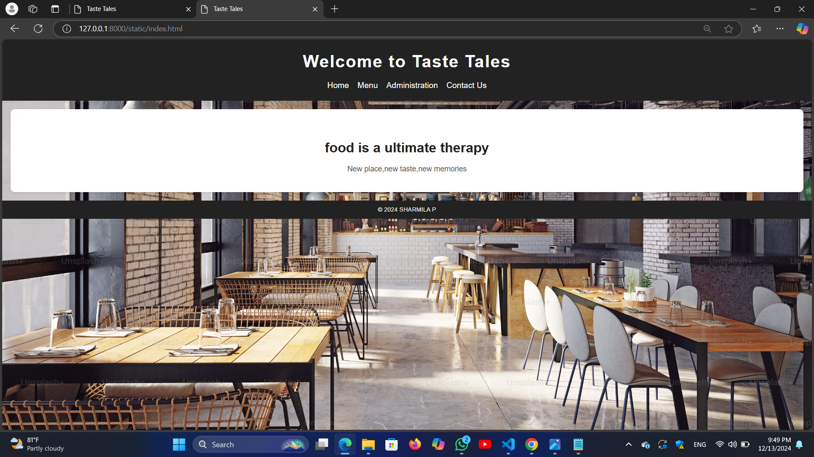
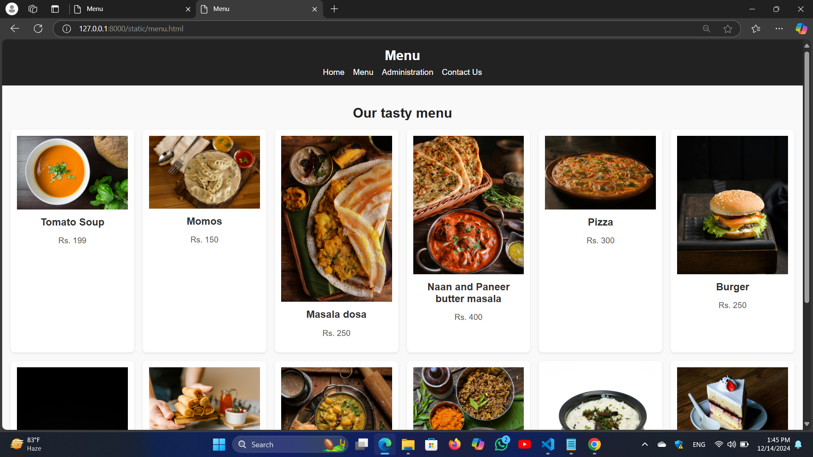
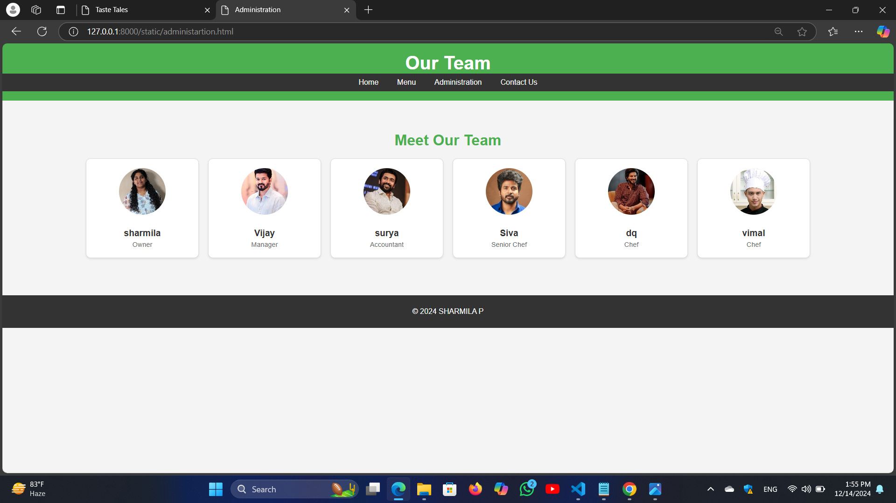
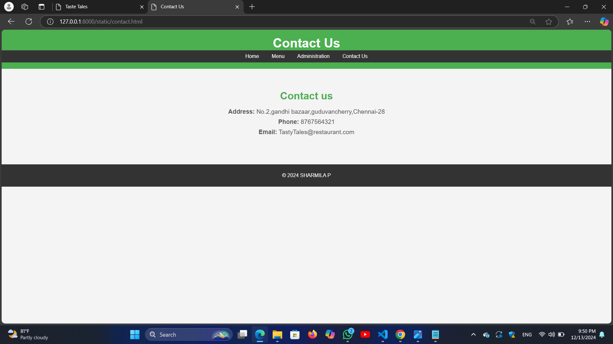

# Ex.07 Restaurant Website
## Date:14:12:2024

## AIM:
To develop a static Restaurant website to display the food items and services provided by them.

## DESIGN STEPS:

### Step 1:
Requirement collection.

### Step 2:
Creating the layout using HTML and CSS.

### Step 3:
Updating the sample content.

### Step 4:
Choose the appropriate style and color scheme.

### Step 5:
Validate the layout in various browsers.

### Step 6:
Validate the HTML code.

### Step 7:
Publish the website in the given URL.

## PROGRAM:
```
index.html
<!DOCTYPE html>
<html lang="en">
<head>
    <meta charset="UTF-8">
    <meta name="viewport" content="width=device-width, initial-scale=1.0">
    <title>Taste Tales</title>
    <link rel="stylesheet" href="style.css">
</head>
<body>
    <header class="banner">
        <h1>Welcome to Taste Tales </h1>
        <nav>
            <ul>
                <li><a href="index.html">Home</a></li>
                <li><a href="menu.html">Menu</a></li>
                <li><a href="administartion.html">Administration</a></li>
                <li><a href="contact.html">Contact Us</a></li>
            </ul>
        </nav>
    </header>

    <section class="intro">
        <h2>food is a ultimate therapy</h2>
        <p>"Where every dish tells a story."</p>
    </section>

    <footer>
        <p>© 2024 SHARMILA P</p>
    </footer>
</body>
</html>

style.css

/* General Reset */
body {
    margin: 0;
    padding: 0;
    font-family: Arial, sans-serif;
    line-height: 1.6;
    color: #333;
    background-image: url('backround.jpg'); /* Replace with your image file path */
    background-size: cover; /* Ensures the image covers the entire screen */
    background-position: center; /* Centers the image */
    background-attachment: fixed; /* Makes the background fixed on scroll */
    background-repeat: no-repeat; /* Prevents repeating of the image */
}

/* Header Styling */
header.banner {
    background-color: #222;
    color: white;
    padding: 20px 10px;
    text-align: center;
}

header.banner h1 {
    margin: 0;
    font-size: 2.5em;
    letter-spacing: 2px;
}

header.banner nav ul {
    list-style: none;
    padding: 0;
    margin: 10px 0 0;
    display: flex;
    justify-content: center;
    gap: 20px;
}

header.banner nav ul li {
    display: inline;
}

header.banner nav ul li a {
    text-decoration: none;
    color: white;
    font-size: 1.2em;
    transition: color 0.3s;
}

header.banner nav ul li a:hover {
    color: #ff6347;
}

/* Intro Section */
section.intro {
    padding: 40px 20px;
    text-align: center;
    background-color: #fff;
    box-shadow: 0 2px 5px rgba(0, 0, 0, 0.1);
    margin: 20px;
    border-radius: 10px;
}

section.intro h2 {
    font-size: 2em;
    color: #222;
    margin-bottom: 10px;
}

section.intro p {
    font-size: 1.1em;
    color: #555;
    margin: 0;
}

/* Footer Styling */
footer {
    text-align: center;
    padding: 10px 0;
    background-color: #222;
    color: white;
    position: relative;
    bottom: 0;
    width: 100%;
}

footer p {
    margin: 0;
    font-size: 0.9em;
}

/* Responsive Design */
@media (max-width: 768px) {
    header.banner nav ul {
        flex-direction: column;
        gap: 10px;
    }

    section.intro {
        margin: 10px;
    }
}

menu

<!DOCTYPE html>
<html lang="en">
<head>
    <meta charset="UTF-8">
    <meta name="viewport" content="width=device-width, initial-scale=1.0">
    <title>Menu</title>
    <style>
        body {
            margin: 0;
            font-family: Arial, sans-serif;
            background-color: #f9f9f9;
            color: #333;
        }

        header.banner {
            background-color: #222;
            color: white;
            padding: 20px;
            text-align: center;
        }

        header.banner h1 {
            margin: 0;
        }

        header.banner nav ul {
            list-style: none;
            padding: 0;
            margin: 10px 0 0;
            display: flex;
            justify-content: center;
            gap: 20px;
        }

        header.banner nav ul li {
            display: inline;
        }

        header.banner nav ul li a {
            text-decoration: none;
            color: white;
            font-size: 1.2em;
            transition: color 0.3s;
        }

        header.banner nav ul li a:hover {
            color: #ff6347;
        }

        .menu {
            padding: 20px;
            text-align: center;
        }

        .menu h2 {
            font-size: 2em;
            color: #222;
            margin-bottom: 20px;
        }

        .menu-items {
            display: grid;
            grid-template-columns: repeat(auto-fit, minmax(250px, 1fr));
            gap: 20px;
            padding: 0;
        }

        .item {
            background: white;
            border-radius: 10px;
            box-shadow: 0 2px 5px rgba(0, 0, 0, 0.1);
            overflow: hidden;
            text-align: center;
            padding: 15px;
        }

        .item img {
            max-width: 100%;
            height: auto;
            border-bottom: 2px solid #f4f4f4;
        }

        .item h3 {
            font-size: 1.5em;
            margin: 10px 0;
        }

        .item p {
            font-size: 1.2em;
            color: #555;
        }

        footer {
            background-color: #222;
            color: white;
            text-align: center;
            padding: 10px 0;
            position: relative;
            bottom: 0;
            width: 100%;
        }

        footer p {
            margin: 0;
            font-size: 0.9em;
        }
    </style>
</head>
<body>
    <header class="banner">
        <h1>Menu</h1>
        <nav>
            <ul>
                <li><a href="index.html">Home</a></li>
                <li><a href="menu.html">Menu</a></li>
                <li><a href="administration.html">Administration</a></li>
                <li><a href="contact.html">Contact Us</a></li>
            </ul>
        </nav>
    </header>

    <section class="menu">
        <h2>Our tasty menu</h2>
        <div class="menu-items">
            <div class="item">
                
                <h3>Tomato Soup</h3>
                <p>Rs. 199</p>
            </div>

            <div class="item">
                
                <h3>Momos</h3>
                <p>Rs. 150</p>
            </div>

            <div class="item">
                
                <h3>Masala dosa</h3>
                <p>Rs.  250</p>
            </div>

            <div class="item">
                
                <h3>Naan and Paneer butter masala</h3>
                <p>Rs. 400</p>
            </div>

            <div class="item">
                
                <h3>Pizza</h3>
                <p>Rs. 300</p>
            </div>

            <div class="item">
                
                <h3>Burger</h3>
                <p>Rs. 250</p>
            </div>

            <div class="item">
                
                <h3>Pork noodle</h3>
                <p>Rs. 1000</p>
            </div>

            <div class="item">
                
                <h3>Veg roll</h3>
                <p>Rs. 60</p>
            </div>

            <div class="item">
                
                <h3>Puri and channa</h3>
                <p>Rs. 120</p>
            </div>

            <div class="item">
                
                <h3>Ice biriyani</h3>
                <p>Rs. 250</p>
            </div>

            <div class="item">
                
                <h3>Curd rice</h3>
                <p>Rs. 200</p>
            </div>

            <div class="item">
                
                <h3>Blueberry cake</h3>
                <p>Rs. 179</p>
            </div>
        </div>
    </section>

    <footer>
        <p>&copy; 2024 SHARMILA P</p>
    </footer>
</body>
</html>

administration

<!DOCTYPE html>
<html lang="en">
<head>
    <meta charset="UTF-8">
    <meta name="viewport" content="width=device-width, initial-scale=1.0">
    <title>Administration</title>
    <style>
        body {
            font-family: Arial, sans-serif;
            margin: 0;
            padding: 0;
            background-color: #f4f4f4;
            color: #333;
        }

        .banner {
            background-color: #4CAF50;
            color: white;
            padding: 20px 0;
            text-align: center;
        }

        .banner h1 {
            margin: 0;
            font-size: 2.5em;
        }

        nav ul {
            list-style: none;
            margin: 0;
            padding: 0;
            display: flex;
            justify-content: center;
            background-color: #333;
        }

        nav ul li {
            margin: 0;
        }

        nav ul li a {
            display: block;
            padding: 10px 20px;
            text-decoration: none;
            color: white;
        }

        nav ul li a:hover {
            background-color: #4CAF50;
        }

        .team {
            padding: 40px 20px;
            text-align: center;
        }

        .team h2 {
            margin-bottom: 20px;
            font-size: 2em;
            color: #4CAF50;
        }

        .team-members {
            display: flex;
            flex-wrap: wrap;
            justify-content: center;
            gap: 20px;
        }

        .member {
            background: white;
            border: 1px solid #ddd;
            border-radius: 10px;
            box-shadow: 0 2px 4px rgba(0, 0, 0, 0.1);
            width: 200px;
            padding: 20px;
            text-align: center;
        }

        .member img {
            width: 100px;
            height: 100px;
            border-radius: 50%;
            object-fit: cover;
            margin-bottom: 15px;
        }

        .member h3, .member h4, .member h5, .member h6 {
            margin: 10px 0 5px;
            font-size: 1.2em;
            color: #333;
        }

        .member p {
            margin: 0;
            font-size: 0.9em;
            color: #666;
        }

        footer {
            text-align: center;
            background-color: #333;
            color: white;
            padding: 10px 0;
            margin-top: 40px;
        }
    </style>
</head>
<body>
    <header class="banner"> 
        <h1>Our Team</h1>
        <nav>
            <ul>
                <li><a href="index.html">Home</a></li>
                <li><a href="menu.html">Menu</a></li>
                <li><a href="administration.html">Administration</a></li>
                <li><a href="contact.html">Contact Us</a></li>
            </ul>
        </nav>
    </header>

    <section class="team">
        <h2>Meet Our Team</h2>
        <div class="team-members">
            <div class="member">
                
                <h3>sharmila</h3>
                <p>Owner</p>
            </div>
            <div class="member">
                
                <h3>Vijay</h3>
                <p>Manager</p>
            </div>
            <div class="member">
                
                <h3>surya</h3>
                <p>Accountant</p>
            </div>
            <div class="member">
                
                <h3>Siva</h3>
                <p>Senior Chef</p>
            </div>
            <div class="member">
                
                <h3>dq</h3>
                <p>Chef</p>
            </div>
            <div class="member">
                
                <h3>vimal</h3>
                <p>Chef</p>
            </div>
        </div>
    </section>

    <footer>
        <p>&copy; 2024 SHARMILA P</p>
    </footer>
</body>
</html>

contact

<!DOCTYPE html>
<html lang="en">
<head>
    <meta charset="UTF-8">
    <meta name="viewport" content="width=device-width, initial-scale=1.0">
    <title>Contact Us</title>
    <style>
        body {
            font-family: Arial, sans-serif;
            margin: 0;
            padding: 0;
            background-color: #f4f4f4;
            color: #333;
        }

        .banner {
            background-color: #4CAF50;
            color: white;
            padding: 20px 0;
            text-align: center;
        }

        .banner h1 {
            margin: 0;
            font-size: 2.5em;
        }

        nav ul {
            list-style: none;
            margin: 0;
            padding: 0;
            display: flex;
            justify-content: center;
            background-color: #333;
        }

        nav ul li {
            margin: 0;
        }

        nav ul li a {
            display: block;
            padding: 10px 20px;
            text-decoration: none;
            color: white;
        }

        nav ul li a:hover {
            background-color: #4CAF50;
        }

        .contact {
            padding: 40px 20px;
            text-align: center;
        }

        .contact h2 {
            margin-bottom: 20px;
            font-size: 2em;
            color: #4CAF50;
        }

        .contact p {
            font-size: 1.2em;
            margin: 10px 0;
            color: #555;
        }

        footer {
            text-align: center;
            background-color: #333;
            color: white;
            padding: 10px 0;
            margin-top: 40px;
        }
    </style>
</head>
<body>
    <header class="banner">
        <h1>Contact Us</h1>
        <nav>
            <ul>
                <li><a href="index.html">Home</a></li>
                <li><a href="menu.html">Menu</a></li>
                <li><a href="administration.html">Administration</a></li>
                <li><a href="contact.html">Contact Us</a></li>
            </ul>
        </nav>
    </header>

    <section class="contact">
        <h2>Contact us</h2>
        <p><strong>Address:</strong> No.2,gandhi bazaar,guduvancherry,Chennai-28</p>
        <p><strong>Phone:</strong> 8767564321</p>
        <p><strong>Email:</strong> TastyTales@restaurant.com</p>
    </section>

    <footer>
        <p>&copy; 2024 SHARMILA P</p>
    </footer>
</body>
</html>
```

## OUTPUT:






## RESULT:
The program for designing software company website using HTML and CSS is completed successfully.
